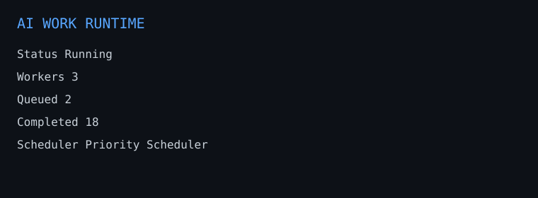

# AI Work Runtime (AWR)

Today's AI frameworks are excellent at orchestrating intelligence, but they leave runtime concerns—work lifecycle, scheduling, recovery, persistence, observability, approvals, and execution management—to application developers. AI Work Runtime (AWR) explores what an operating system for AI work could look like.

Every task is a persistent `WorkItem` in a work graph, not a transient function call, prompt chain, or chat turn.

AWR manages work. Execution adapters perform work.

## What AWR is

AI Work Runtime is a runtime responsible for managing AI work. It owns:

- lifecycle
- scheduling
- dependency management
- persistence
- replay
- recovery
- artifacts
- metrics
- approvals
- observability

It deliberately does **not** own planning or reasoning. Planners decide what work should exist. AWR decides what can execute now. Execution adapters decide how the work is executed.

## What AWR is not

AWR is **not**:

- an agent framework
- a planner
- a memory framework
- a RAG framework
- an LLM wrapper

It is the execution runtime that sits beneath those systems.

## Relationship with existing frameworks

AWR is designed to complement—not replace—frameworks such as LangGraph, CrewAI, AutoGen, and the OpenAI Agents SDK.

Those frameworks determine **how intelligence is executed**. AWR determines **how AI work is managed**.

## Layered architecture

```text
Planner
  ↓
AI Work Runtime
  ↓
Execution Adapter
  ↓
Execution Framework
  ↓
Agents
  ↓
LLMs / Tools
```

Examples:

```text
LangGraph Execution Adapter → LangGraph Graph → LLM
CrewAI Execution Adapter    → Crew             → Agents → LLM
Python Execution Adapter    → Python Function
Human Execution Adapter     → Approval Workflow
```

The runtime should never know how many agents were created, whether LangGraph or CrewAI was used, whether execution happened locally or remotely, or whether the work ran in Python, Docker, Kubernetes, or a human approval queue.

The runtime only knows this contract:

```text
WorkItem → Execution Adapter → ExecutionResult
```

## Current MVP architecture

At runtime, components are composed as a small local control plane:

1. CLI receives operational commands such as `create`, `start`, `watch`, and `timeline`.
2. `WorkRegistry` creates and updates work while enforcing lifecycle transitions.
3. `DependencyManager` checks unresolved dependencies and active blockers.
4. `Scheduler` picks runnable work using the default priority-first policy.
5. `ExecutionAssignmentEngine` assigns runnable work to a compatible execution adapter.
6. `EventBus` emits every significant action and writes it to durable storage.
7. `SQLiteRuntimeStore` stores work items and immutable events.
8. Execution adapters execute external work and return `ExecutionResult`.

## Core modules

- `awr/domain/`: `WorkItem`, `Status`, lifecycle transition guards, artifacts, metadata, lineage fields, costs, tokens, dependencies, blockers, and timestamps.
- `awr/runtime/`: lifecycle registry, dependency manager, scheduler policy, runtime engine, stats, and graph snapshots.
- `awr/executors.py`: execution adapter contract, executor manager, and assignment engine.
- `awr/storage/`: storage protocols and the SQLite backend.
- `awr/events/`: in-process pub/sub event bus with durable sink integration.
- `awr/agents/`: optional gateway smoke adapter examples.
- `awr/cli/`: local operational command surface.

## Quick start

```bash
python -m venv .venv
source .venv/bin/activate
pip install -e .
awr create "Research competitors" --description "Find market alternatives" --ready
awr start --once
awr watch --once
awr timeline
```



By default the CLI stores runtime state in `awr.sqlite` in the current directory. Override it with `--db path/to/runtime.sqlite`.

## CLI surface

```text
start, watch, status, timeline, demo supplier-research
create, list, graph, graph --mermaid, graph --json, events --follow, run
executors, metrics, replay, recover
pause, resume, cancel, retry, approve, lineage
gateway-smoke --prompt "..."
```

## Demo

```bash
awr --db demo.sqlite demo supplier-research
awr --db demo.sqlite graph --mermaid
awr --db demo.sqlite replay
```

The demo highlights runtime behavior: work submission, scheduling, execution adapter assignment, execution, artifacts, timeline, metrics, graph, and replay.

## Key design principle

AWR remains completely agnostic to the execution framework. Whether a `WorkItem` is executed by LangGraph, CrewAI, AutoGen, Python, Docker, a human, or a Kubernetes Job, the runtime always interacts through the same contract: `WorkItem → Execution Adapter → ExecutionResult`.

## Not implemented yet

- REST API server.
- Dashboard UI.
- Distributed execution and multi-user operation.
- Full LangGraph, CrewAI, AutoGen, OpenAI Agents SDK, Temporal, Airflow, and MCP adapters.
- Deadline/cost/executor-capacity-aware scheduling policies.
