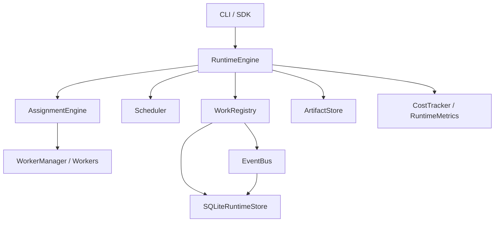

# Architecture

```mermaid
flowchart TD
  CLI[CLI / SDK] --> Engine[RuntimeEngine]
  Engine --> Registry[WorkRegistry]
  Engine --> Scheduler[Scheduler]
  Engine --> Assign[AssignmentEngine]
  Assign --> Workers[WorkerManager / Workers]
  Registry --> Events[EventBus]
  Registry --> Store[SQLiteRuntimeStore]
  Events --> Store
  Engine --> Artifacts[ArtifactStore]
  Engine --> Metrics[CostTracker / RuntimeMetrics]
```

AWR treats work as durable runtime state. Workers execute assigned work and return results; the runtime owns lifecycle, events, scheduling, assignment, artifacts, and recovery.
