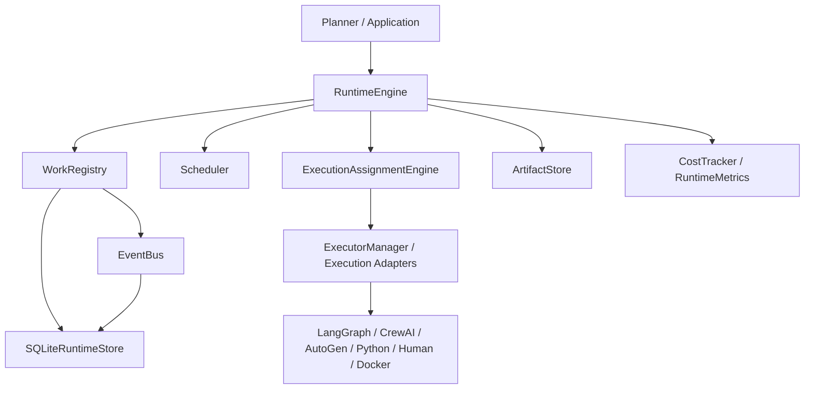

# Architecture

AWR treats work as durable runtime state. Execution adapters execute assigned work and return results; the runtime owns lifecycle, events, scheduling, assignment, artifacts, metrics, replay, and recovery.
