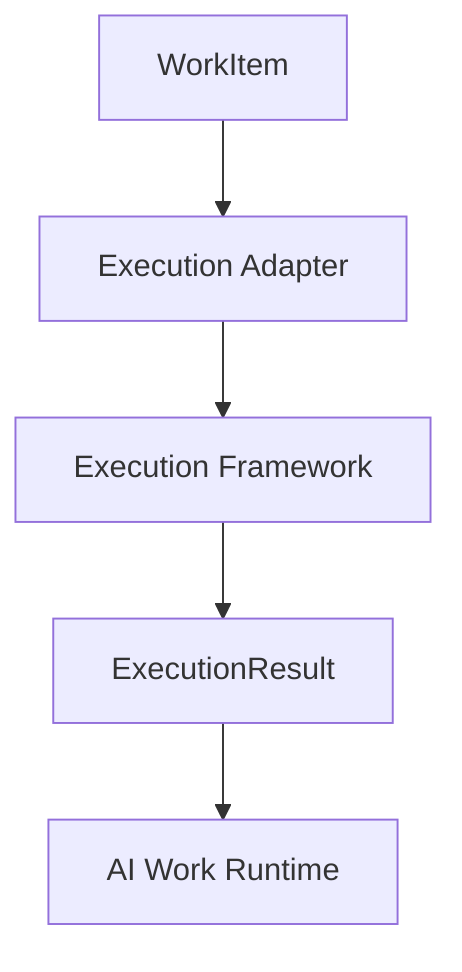

# Execution Adapters

Execution adapters are the boundary between AWR and any execution technology.

An adapter may wrap LangGraph, CrewAI, AutoGen, Python, Docker, a human approval flow, or a Kubernetes Job. The runtime treats all of them identically: it passes a `WorkItem` to `execute()` and receives an `ExecutionResult`.

Adapters must not mutate runtime state, schedule retries, create child work, or write events directly. Those responsibilities remain in the runtime.
