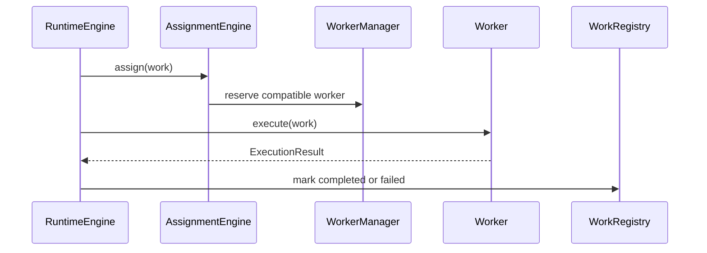

# Worker Model

Workers are plugins with capabilities and capacity. They do not mutate lifecycle state, schedule retries, or write events directly.

```mermaid
sequenceDiagram
  RuntimeEngine->>AssignmentEngine: assign(work)
  AssignmentEngine->>WorkerManager: reserve compatible worker
  RuntimeEngine->>Worker: execute(work)
  Worker-->>RuntimeEngine: ExecutionResult
  RuntimeEngine->>WorkRegistry: mark completed or failed
```
