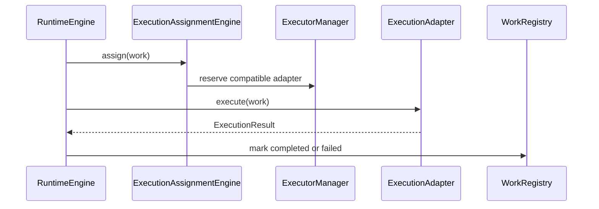

# Execution Adapter Model

The original code used the term “worker.” Public documentation now uses **execution adapter** because many AI frameworks do not run as persistent workers. They instantiate a graph, crew, conversation, job, or function for one execution and then disappear.

The runtime manages work. Execution adapters execute work.
